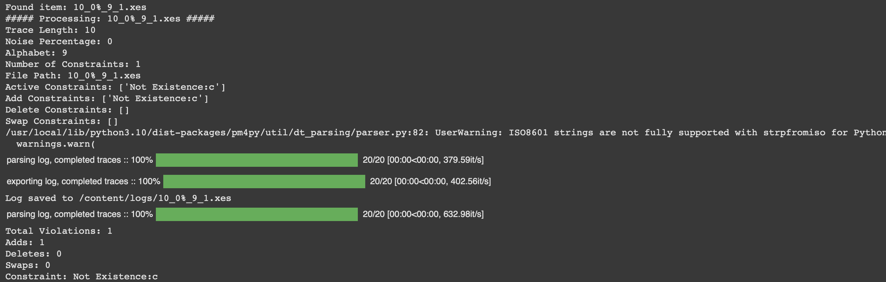
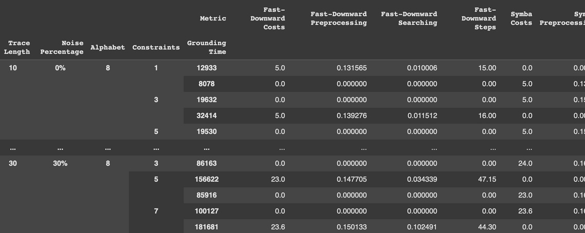

# LifeCycleAligner


The LifeCycleAligner is a tool designed to ensure planner-based-activity-lifecycle-aware trace alignment by converting event logs and constraints models into PDDL files.
It provides a seamless way to work with activity-lifecycle-constrained trace alignment using process mining standards like XES for event logs and XML & DOT for constraints models.
This work is part of a master thesis, which can be found in the directory `/presentation`.

-----------
## Table of Contents
- [Repository Structure](#repository-structure)
- [Project Description](#project-description)
- [Features](#features)
- [Installation Instructions](#installation-instructions)
- [Usage](#usage)
- [Tests](#tests)
- [Contributing](#contributing)
- [License](#license)
- [Contact](#contact)
- [Acknowledgements](#acknowledgements)

-----------
## Repository Structure
The repository contains two different tool corresponding to two versions of the LifeCycleAligner :
- The first not grounded implementation, is a preliminary, more explicit but less-efficient version of the tool written in Python.
It accepts an event log, formatted in XES and constraints models expressed in DOT format.
- The second grounded version, is a more efficient Java application that creates <domain.pddl, problem.pddl> couples. 
The program, creates strictly linked instances that allows the planner to efficiently search in the state space. 
It accepts an event log, formatted in XES and constraints models expressed in XML and/or DOT format.
The repository also contains:
- A python noiser script that has the aim of formatting our event logs and injecting them with the specified amount of noise.
- A Python test script to parse the result of the Java tool and embed them in a csv file.
- The related tests and results based on our experimental setup.

-----------
## Project Description

The **LifeCycleAligner** repository provides tools for planning-based trace alignment with a focus on lifecycle activity analysis within event logs. It aligns event logs to predefined domain models using PDDL (Planning Domain Definition Language) files, enabling process execution analysis from a planning perspective.

### Key Components

- **Non-Grounded Python Implementation**:
   - Generates non-grounded PDDL problem files compatible with a specified domain file.
   - Facilitates planner-based trace alignment, considering the lifecycle of each activity in the log.
   - **Input formats**:
      - Event logs in XES format.
      - Constraints models in DOT format.
   - Outputs non-grounded PDDL problem files for planning and activity-lifecycle aware trace alignment.


- **Grounded Java Implementation**:
   - Generates `<domain.pddl, problem.pddl>` couples, with the problem file tightly linked to the domain.
   - Improves planner efficiency by reducing the number of nodes to evaluate in the state space.
   - **Input formats**:
      - Event logs in XES format.
      - Constraints models in XML and DOT formats.
   - Produces strictly linked instances for a more efficient planning search.
   

- **Additional Tools**:
   - **Python Noiser Script**: Injects noise into event logs, allowing controlled manipulation and formatting with specified noise levels.
    
   - **Python Test Script**: Parses Java tool output and processes the results into CSV files for easy analysis and reporting.
     
   - **Test Cases and Experimental Results**: Predefined tests and results for evaluating the performance and accuracy of both versions.

### Purpose and Use Cases

The LifeCycleAligner repository enables users to:
- Align event logs with planning-based trace alignment techniques.
- Generate PDDL files for planning tasks and analyze activity lifecycles.
- Evaluate planner performance and experiment with noise scenarios.

### Summary

This repository offers a comprehensive solution for lifecycle-based trace alignment using PDDL, supporting both grounded and non-grounded planning techniques. With Python and Java tools, along with scripts for noise injection and result processing, it provides a powerful suite for event log analysis and planning-based alignment tasks.

-----------
## Features

- Converts DOT and XES files into PDDL problem files for lifecycle-constrained trace alignment.

- Supports integration with planning tools for automated trace alignment.

- Leverages powerful libraries (PM4Py, PyDot) for handling process mining and graph data.

- Ensures compatibility with existing PDDL domain definitions.

-----------
## Installation Instructions


### Clone the repository:

```bash
git clone https://github.com/GianmarcoBordin/LifeCycleAligner.git
```

### Navigate to the project version-specific directory:

```bash
cd LifeCycleAligner/{version}
```

### Install required dependencies:

#### For the Python-based (Non-Grounded) Implementation:
##### Prerequisites

- Python 3.7+
- pip (Python package installer)
- `pydot` (for DOT file processing)
- `pm4py` (for event log handling)

##### To install the required dependencies, run:

```bash
pip install pydot pm4py
```

#### For the Java-based (Grounded) Implementation

##### Prerequisites

- **JDK 22** (Java version "22", released 2024-03-19)
    - Install JDK 22 from the [official Java website](https://www.oracle.com/java/technologies/javase/jdk22-archive-downloads.html).

- **Docker** (for containerized execution)
    - Install Docker by following the instructions on [Docker's official website](https://www.docker.com/get-started).
    - Ensure Docker version `24.0.5` is installed (you can check using `docker --version`).

##### Regarding the required dependencies:

- All required libraries are included within the project.
- If you plan to use Docker for containerized planners execution, ensure Docker is installed, then follow the specific containerization instructions.

-----------
## Usage
To use the project, follow these steps:

### Prepare the input files:

   - **DOT/XML file(s)**: Describing your model constraints.
   - **XES file**: Describing your event log traces.

### Run the selected tool version:

#### For the Python-based (Non-Grounded) Implementation:

```bash
python pddl_translator.py --dot input_model.dot --xes event_log.xes --output output_folder/
```

The tool will generate PDDL problem files in the specified output folder. Each problem file corresponds to a trace in the event log.

##### Example output

The output folder `/problems` will contain files like:

- `trace_Alignment_Problem_{trace_case_id}.pddl`

#### For the Java-based Grounded Implementation

For the grounded Java version, the project will generate both `domain.pddl` and `problem.pddl` files. 
You can follow the instructions within the Java project for running the planner and generating the aligned traces.

##### Example output

The output folder `/Conformance_Checking` will contain files like:

- `domain{trace_case_id}.pddl`
- `problem{trace_case_id}.pddl`

-----------
## Tests

The project includes a set of tests to help you validate the functionality of the Java-based implementation.


You can find the related results in the corresponding `/results` folder.


### Python Test Scripts

The Python test scripts are used to inject noise into the event logs and to parse the results.
The test cases are designed to check the correctness of the generated PDDL files and the behavior of the alignment process.
This segment includes to scripts:

- `Noiser.py` used to inject different noise levels and additionally providing formatting.
- `Tests.py` used to parse the results file from the Java-based application adn put them in a csv file.

### Java Planner Integration

The **Fast Downward** planner (version `23.06`) is used for the grounded Java implementation, and **SymBA** (version `symba2*`) is also supported. Make sure these planners are configured and set up as part of your environment if needed.

-----------
## Contributing
    
    We welcome contributions! To get started:
    
1. Fork the repository.
2. Create a new branch:

    ```bash
        git checkout -b feature-name
    ```
3. Make your changes and commit them:

    ```bash
          git commit -am 'Add feature'
    ```
4. Push to the branch:

    ```bash
          git push origin feature-name
    ```
    git push origin feature-name

5. Create a pull request describing your changes.

6. For larger changes, please open an issue to discuss it first.

-----------
## License
    
This project is licensed under the MIT License.

-----------
## Contact

For any questions or inquiries, feel free to reach out:
- **GitHub**: [github.com/GianmarcoBordin](https://github.com/GianmarcoBordin)

-----------
## Acknowledgements
- Graphviz and the DOT language


- PM4Py and PyDot libraries for their invaluable support in handling process mining and graph data.


- Special thanks to the authors of the article **On the Disruptive Effectiveness of Automated Planning for LTL\f-Based Trace Alignment**. You can access the article [here](https://hdl.handle.net/11573/965532).


- Special thanks to the process mining and automated planning communities for their contributions and insights.
